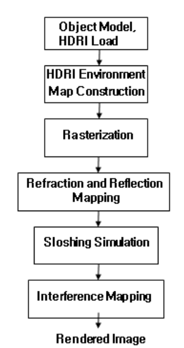
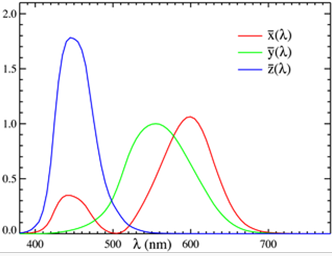
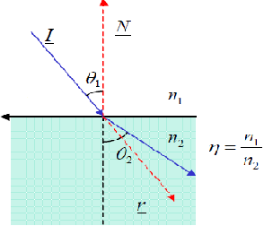
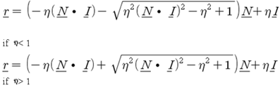
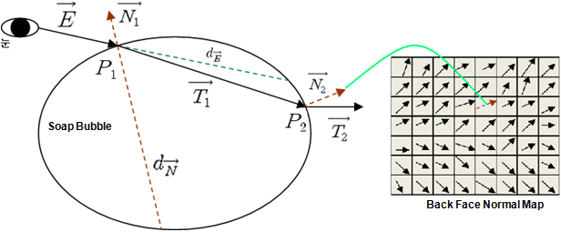
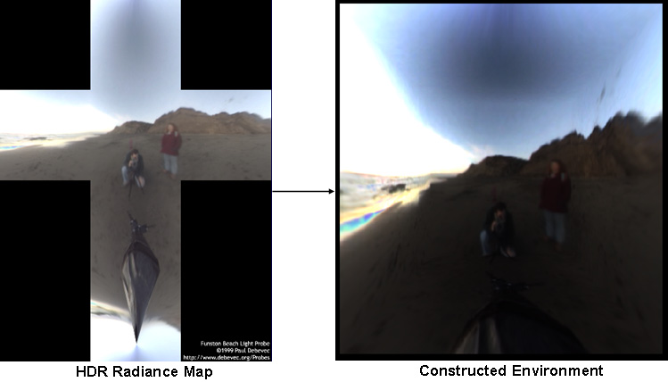

# 实时渲染肥皂泡上出现的虹彩颜色

**Namjung Kim and Kyoungju Park**
cgnamman@naver.com, kjpark@cau.ac.kr

* 实时渲染肥皂泡上出现的虹彩颜色的新技术。
* 配置了基于垂直和平行于入射面偏振光的光学相位反射率。
* 在这个框架上，使用光栅化来实现主光线的相交，并有效地近似折射和反射以实现实时性能。
* 使用基于GPU的Perlin噪声来模拟皂膜之间的晃动效果。这使得在实时动态环境中渲染具有视觉信服效果的肥皂泡成为可能。

## 1 引言

无需用户手动输入即可实时渲染肥皂泡上出现的虹彩颜色。

我们结合了光学相位反射率和CIE-XYZ颜色转换，并产生了令人信服的结果。此外，框架有效地近似了折射和反射。

方法流程图:
 

## 2 光栅化

使用光栅化方法。
如等式(1)调整投影设置，以匹配光线追踪主交点和光栅化的结果。光栅化的投影角是从相机和图像平面之间的关系有效地计算出来的。

$\text{投影角} = 2 \times \tan^{-1}\left(\frac{\text{图像平面宽度} / 2}{\text{相机的Z轴距离}}\right)$       (1)

## 3 干涉映射

将光干涉作为基于光谱的方法来处理。将入射光处理为采样光谱。每个采样光谱由以下两个阶段计算得出。

### 3.1 光学相位反射率计算

肥皂泡的虹彩颜色在阳光等高辐射环境中非常明显且色彩丰富。因此，我们采用了光学界针对高辐射单色光和薄膜的光学方程。根据这种方法，如果薄膜被光谱组成为 $I_{in}(\lambda)$ 的光源照射，则反射光强度由等式(2)给出。

$I_r(\lambda) = R_\lambda I_{in}(\lambda)$ (2)

$R_\lambda$ 是反射率，由等式(3)给出。

$R_\lambda = \frac{R_s^2(1 - \cos \varphi)}{1 + R_s^4 - 2R_s^2 \cos \varphi} + R_p^2 \frac{1 - \cos \varphi}{1 + R_p^4 - 2R_p^2 \cos \varphi}$ (3)

$R_s$ 和 $R_p$ 分别是垂直和平行于入射面的偏振光反射的振幅系数，由等式(4)计算。

$R_s = \frac{\cos \theta - \sqrt{n^2 - \sin^2 \theta}}{\cos \theta + \sqrt{n^2 - \sin^2 \theta}}$
$R_p = \frac{n^2 \cos \theta - \sqrt{n^2 - \sin^2 \theta}}{n^2 \cos \theta + \sqrt{n^2 - \sin^2 \theta}}$ (4)

$\theta$ 是入射光的入射角。反射波之间的相位差由等式(5)给出。

$\varphi(\lambda, \theta) = \frac{4\pi d}{\lambda} \sqrt{n^2 - \sin^2 \theta}$ (5)

$n$ 是皂膜的折射率， $d$ 是皂膜的厚度， $\lambda$ 是入射光的波长。

### 3.2 光谱颜色转换

在计算出反射率强度后，将每个波的强度转换为CIE-XYZ颜色，以生成有关光波属性的适当颜色。

1.我们计算傅里叶基函数和入射波光谱。
2.使用关于绘制的颜色匹配函数值的积分来计算CIE-XYZ颜色转换。

颜色匹配函数:
 

积分公式;
$X = \int I(\lambda)x(\lambda)d\lambda$
$Y = \int I(\lambda)y(\lambda)d\lambda$
$Z = \int I(\lambda)z(\lambda)d\lambda$ (6)

3.将XYZ颜色转换为RGB颜色，并将范围限制在0到1之间。

## 4 折射映射

当光线进入其他介质时，光线会根据斯涅尔定律改变光路。
 
折射向量r可以从斯涅尔定律推导出来:

 (7)

如果从内部到外部的射出点是通过相交测试计算的，那么计算成本会非常高。由于单个肥皂泡有四次折射，计算成本是一个更为重要的问题。因此，通过部署 Wyman 的近似技术来有效地近似这个过程。

上图简单展示折射过程的近似。在人眼位置，我们寻找肥皂泡正面和背面深度值 ($d_E$) 的差异。并生成肥皂泡背面的法线贴图。然后在 $P_1 + N_1$ 位置获取正面和背面的深度值差异 ($d_N$)。利用等式(7)从 $E$ 和 $N_1$ 获取 $T_1$。

$P_2 = P_1 + d \cdot T_1$
$d = \frac{d_E + d_N}{2}$ (8)

使用等式(8)获取从肥皂泡内部到外部的光线射出位置 ($P_2$)。将 $P_2$ 乘以定义在眼睛位置的投影矩阵，投影到背面法线贴图上。然后我们在射出位置获取法向量 $N_2$ 并获取折射向量 $T_2$。最后 $T_2$ 用于环境贴图的折射。

## 5 反射与 HDRI 映射

通常菲涅尔项被广泛用于表示诸如肥皂泡等透明物体表面的反射效果。但是菲涅尔项具有相对较高的计算成本。因此，我们使用菲涅尔项的近似方法来提高渲染性能。

等式(9)显示了此近似项，$\theta$ 是入射光与折射表面法向量之间的夹角。

$R(\theta) = R_0 + (1 - R_0)(1 - \cos \theta)^5$ (9)

传统的成像系统在表示真实世界的辐射分布方面存在局限性。HDRI（高动态范围图像）是克服这一局限性的创新技术。为了表示真实世界的辐射，使用实时 HDRI 纹理映射技术构建 HDR 环境立方体贴图。因此，通过使用环境映射技术，自然光的辐射从肥皂泡反射和折射。
下图展示HDRI环境映射。

## 6 晃动模拟

肥皂泡由肥皂分子和水分子组成。在皂膜中，两个平行的肥皂分子层夹着一层水分子。因为水分子在外力（如风和重力）作用下相对于肥皂分子很容易移动，肥皂泡会因水分子运动而产生晃动效果。

我们利用基于 GPU 的 Perlin 噪声技术，通过改变移动肥皂泡的厚度来近似晃动效果。晃动效果是在片段程序中关于片段的每个厚度计算的。

## 7 模拟结果

我们使用配备了 Intel i7 CPU 2.80Ghz、Nvidia GTX260 图形硬件的计算机，分辨率为 1024x1024。开发环境是基于 Window7、OpenGL 和 GLSL 的 Visual C++。每个肥皂泡由包含 10,242 个顶点和 20,480 个三角形的球体模型组成。图6显示了两个肥皂泡的渲染结果，总共 40,960 个三角形以平均每秒 76.1 帧的速度渲染。图7显示了 56 个肥皂泡的渲染结果，总共 1,146,880 个三角形以平均每秒 24.5 帧的速度渲染。

## 8 结论

本文提出了一种考虑光干涉的肥皂泡实时渲染方法。我们利用与入射面偏振相关的光学相位反射率和 CIE-XYZ 颜色转换，来渲染肥皂泡上出现的虹彩颜色。为了提高渲染性能，我们包含了几种方法，即基于 GPU 的光栅化方法以及反射和折射的有效近似。并且我们使用基于 GPU 的 Perlin 噪声来模拟皂膜之间的晃动效果。所提出的系统在实时动态环境中提供了考虑光干涉的肥皂泡令人信服的渲染结果。对于未来的工作，我们希望模拟排液现象并实现更准确的干涉效果。

## 我们怎么做
### 1.干涉
写一个离线的小脚本，把论文里那些复杂的干涉公式提前算好。生成一张 2D 贴图（Texture）。X 轴代表视线与法线的夹角（$N \cdot V$），Y 轴代表泡泡膜的厚度（Thickness）。贴图里的颜色就是算好的干涉 RGB 颜色。
在 Fragment Shader 里只需要 texture(iridescenceLUT, vec2(NdotV, thickness)) 就可以，性能开销小
### 2. 色散
这个论文没有说。色散是肥皂泡上的颜色吗，这和干涉不是一回事？

### 3.折射
论文方案： Wyman 的屏幕空间双 Pass 深度近似法，太古老了。
方案 A：基于 CubeMap 的环境折射。 把周围环境烘焙成全景贴图，利用 GLSL 内置的 refract() 函数直接采样。这不能折射“泡泡后面的另一个泡泡”，但单体效果极好。
方案 B：屏幕空间折射（Screen Space Refraction / GrabPass）。 利用 OpenGL ES 的 FBO（帧缓冲对象）。在渲染泡泡之前，先把当前的背景（比如其他泡泡和 UI）渲染到一张纹理上（Texture）。在渲染当前泡泡时，根据法线对这张背景纹理进行扭曲采样（UV 偏移）。这能真实地折射画面中的其他动态物体。
考虑多个泡泡间的折射，适合用这种 FBO 截屏扭曲的方法。
### 4. 晃动模拟（Sloshing / 动态形变）
论文原方案： GPU Perlin Noise 改变厚度，太古老了
可以在 Fragment Shader 中引入 3D Simplex Noise，传入 vec3(uv, time)，用返回的噪声值去干扰上面提到的 LUT 贴图的 Y 轴（厚度），实现表面色彩的流转。
