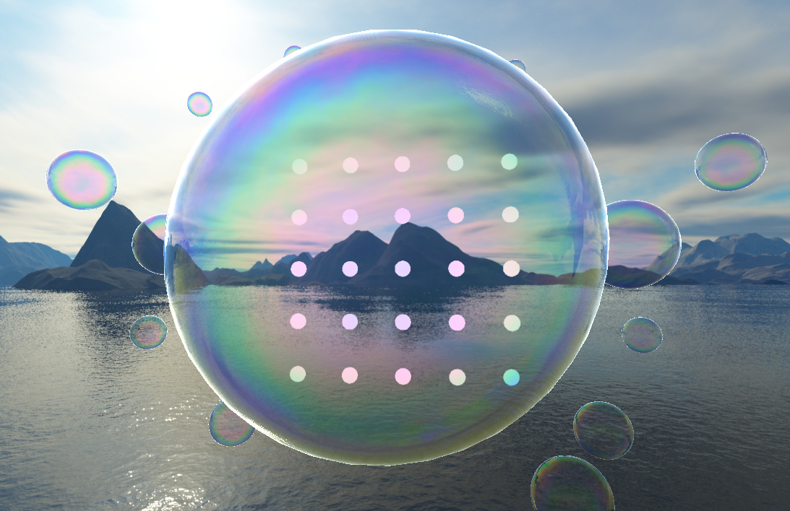

<div align="center">

#  BubbleRender — 透明物体实时折射与色散渲染系统

</div>
PB23010350杨弘宇 PB23010362常毅寒 PB23000052杨硕

---

##  效果展示



---

## 项目背景

本项目为 **【CCF CAD/CG 2026】高质量实时渲染技术挑战** 初赛参赛作品，赛题为 **"基于鸿蒙的透明物体实时色散渲染系统"**。

随着移动端图形硬件和操作系统图形框架的发展，实时渲染技术正在从传统 PC 设备扩展到移动端与鸿蒙设备。透明物体——玻璃、水晶、水滴、**肥皂泡** 等——具有复杂的光学行为：

- 光线穿过不同密度介质时会发生折射，透过泡泡看到的背景产生扭曲
- 不同波长的光折射率不同，在边缘产生彩虹状的色散分离
- 泡泡表面薄膜（厚度仅数百纳米）会产生薄膜干涉，呈现随观察角度变化的虹彩
- 多个透明物体叠加时存在复杂的视觉交互

比赛以"肥皂泡"的折射和色散效果为核心，要求在 HarmonyOS 平台上实现一个实时、可交互、具有视觉表现力的透明物体渲染系统。


目前该项目已在 Windows 桌面端完成以下核心功能：

**渲染方面** — 三阶段屏幕空间折射管线（背景 FBO → 泡泡背面 FBO → 屏幕合成），FBO overscan 防止边缘采样越界。薄膜干涉虹彩支持三种模型（Kim2012 实时 RGB 采样、Spectral LUT 预计算查表、Belcour Airy 解析预积分），一键切换。膜厚随时间动态变化，最终颜色由折射背景、虹彩反射、环境反射和漫反射按菲涅尔权重物理混合。

**物理模拟方面** — 基于 Da et al. 2015 DBSTT 论文的涡流片泡泡动力学：表面张力驱动环量，Biot-Savart 积分反推速度场，泡泡呈现真实的晃动、振荡与阻尼收敛，区别于简单的参数动画。配合位移钳制、质心校正和环量扩散确保仿真不发散。场景支持 5×5 背景球阵产生空间层次感。

**交互方面** — 左键旋转视角、右键触摸涟漪（局部膜厚扰动，指数衰减）、滚轮缩放。键盘可实时调节 20+ 个渲染与仿真参数。

**下一阶段** — 将桌面端验证通过的渲染逻辑迁移至 HarmonyOS（XComponent + EGL + NAPI + ArkTS UI），实现多泡泡折射叠加与移动端性能优化，准备复赛答辩。


##  成员分工

杨弘宇：Kim2012方法实现、动力学模拟论文调研、DBSTT方法实现、对应部分实验报告撰写
常毅寒：官方实验框架修复与配置、渲染部分论文调研、Spectral LUT 和Belcour Airy渲染方法实现与调参优化、对应部分实验报告撰写、demo录制
杨硕：渲染部分论文调研、泡泡触摸交互实现、对应部分实验报告撰写

---

##  效果演示

<video width="100%" controls>
  <source src="../demo.mp4" type="video/mp4">
  您的浏览器不支持视频标签，请 <a href="../demo.mp4">下载视频</a> 观看。
</video>


---

##  使用说明

### 环境要求

| 组件     | 说明                    |
| -------- | ----------------------- |
| 操作系统 | Windows 10/11           |
| 编译器   | Visual Studio 2022      |
| 构建工具 | CMake 3.16+             |
| 包管理   | vcpkg                   |
| 图形 API | OpenGL 3.3 Core Profile |

### 依赖库

```text
glfw3    — 窗口管理
glad     — OpenGL 函数加载
glm      — 数学库
stb_image — 纹理加载
```

通过 vcpkg 安装：

```bash
vcpkg install glfw3 glad glm stb
```

### 构建与运行

```bash
# 克隆仓库
git clone https://github.com/ehancii66-svg/BubbleRender.git
cd BubbleRender

# 配置 CMake（使用 vcpkg toolchain）
cd windows
cmake -B build -S . \
  -DCMAKE_TOOLCHAIN_FILE=../vcpkg/scripts/buildsystems/vcpkg.cmake

# 编译 Release
cmake --build build --config Release

# 运行
./build/Release/BubbleRender.exe
```

### 操作方式

| 操作         | 功能                                                 |
| ------------ | ---------------------------------------------------- |
| 鼠标左键拖拽 | 旋转视角                                             |
| 鼠标右键拖拽 | 触摸泡泡涟漪                                         |
| 鼠标滚轮     | 缩放                                                 |
| `3` / `4`    | 表面张力 ±1                                          |
| `5` / `6`    | 环量扩散 ±0.0002                                     |
| `7` / `8`    | 仿真子步数 ±1                                        |
| `9`          | 翻转 dΓ 符号                                         |
| `Z`          | 暂停/恢复仿真                                        |
| `X`          | 重置泡泡                                             |
| `R` / `T`    | Fresnel 强度 ±0.5                                    |
| `F` / `G`    | 漫反射 ±0.05                                         |
| `Y` / `H`    | 折射强度 ±0.1                                        |
| `L`          | 切换虹彩模式 (Kim2012 / Spectral LUT / Belcour Airy) |
| `N` / `M`    | 薄膜厚度 ±20 nm                                      |
| `ESC`        | 退出                                                 |

---


## 下一步工作

当前所有功能均在 Windows 桌面端实现，下一步工作重心是鸿蒙平台迁移与复赛准备：

- [ ] **鸿蒙平台迁移** — 桌面 OpenGL → OpenGL ES；GLFW → XComponent；鼠标交互 → 触摸交互
- [ ] **NAPI + ArkTS UI** — C++ 渲染层通过 NAPI 对接 ArkTS 页面，实现参数调节面板
- [ ] **多泡泡交互** — 多个泡泡同时渲染，处理泡泡间折射叠加与深度排序
- [ ] **性能优化** — 针对移动端 GPU（Mali/Adreno）的 Shader 优化与帧率保障
- [ ] **现场 Demo** — 确保真机稳定运行，准备答辩演示流程

## 致谢
感谢刘利刚老师的精彩图形学课程，让我们收获颇丰；
感谢蔡有城老师和高凡助教在项目完成过程中的启发式点拨和细致指导