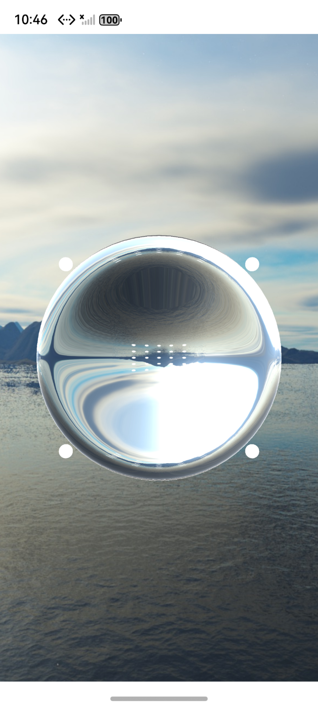

# 基于鸿蒙的透明物体实时色散渲染系统

## 简介

本篇代码提供赛题2-基于鸿蒙的透明物体实时色散渲染系统的基础程序，使用Native C++模板创建，通过XComponent组件调用NAPI创建EGL/OpenGL ES环境，当前版本默认在 XComponent 中渲染一个透明球体。

## 效果预览


## 相关概念

- [EGL(Embedded Graphic Library)](https://developer.huawei.com/consumer/cn/doc/harmonyos-references/egl)：EGL 是Khronos渲染API (如OpenGL ES 或 OpenVG) 与底层原生窗口系统之间的接口。
- [XComponent](https://developer.huawei.com/consumer/cn/doc/harmonyos-references/ts-basic-components-xcomponent)：可用于EGL/OpenGL ES和媒体数据写入，并显示在XComponent组件。

## 工程目录
```
├─entry/src/main                        // 代码区
│  ├─cpp
│  │  ├─CMakeLists.txt                    // native层编译配置
│  │  ├─napi_init.cpp                     // native api层接口的具体实现函数
│  │  ├─libs                              // 第三方动态库
│  │  ├─render                            // 渲染
│  │  ├─shader                            // 着色器
│  │  ├─thirdParty                        // 第三方库
│  │  └─types
│  │      └─libentry
│  │          └─Index.d.ts                // native层接口注册文件
│  ├─ets
│  │  ├─entryability
│  │  │   └─EntryAbility.ets              // 程序入口类
│  │  ├─entrybackupability     
│  │  └─pages
│  │      └─Index.ets                     // 主界面
│  │          
│  └─resources                            // 资源
│     ├─base
│     ├─dark 
│     └─rawfile
│         └─skybox                        // 图片资源
```

## 依赖

* 本示例提供assimp第三方库以及系统版本对应的编译结果，如需要替换请按系统版本[编译](https://gitee.com/openharmony-sig/tpc_c_cplusplus/tree/master)对应版本第三方库。

## 约束与限制

本示例基于以下环境构建，支持DevEco Studio提供的模拟器：
1. HarmonyOS系统：HarmonyOS 6.0.2（API 22）。
2. DevEco Studio版本：DevEco Studio 6.0.2。
3. HarmonyOS SDK版本：HarmonyOS SDK 6.0.2。
